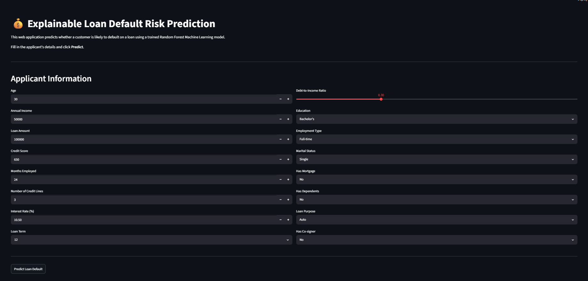
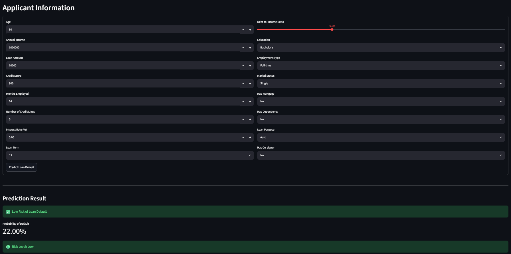
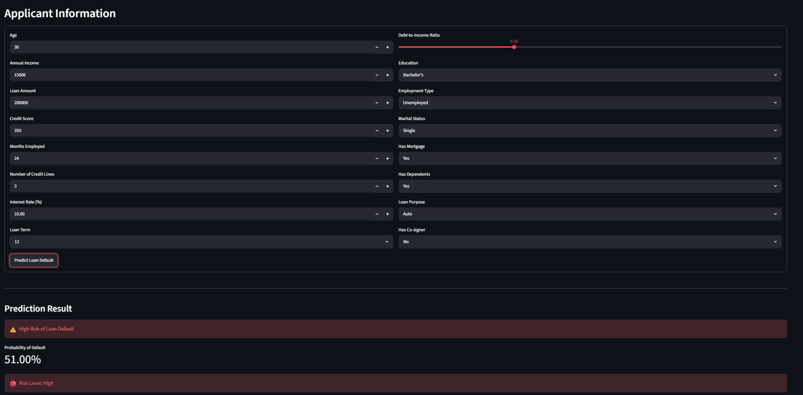

# 💰 Explainable Loan Default Risk Prediction

An end-to-end Machine Learning project that predicts whether a loan applicant is likely to default based on financial and demographic information. The project includes data exploration, preprocessing, model building, explainability using SHAP, and deployment through an interactive Streamlit web application.

---

# 📖 Project Overview

Loan default prediction is one of the most important applications of Machine Learning in the banking and finance industry.

Financial institutions receive thousands of loan applications every day. Predicting whether an applicant is likely to default helps banks reduce financial risk and make better lending decisions.

This project uses historical loan applicant data to build and evaluate multiple machine learning models. After comparing different algorithms, a **Random Forest Classifier** was selected as the final model and deployed using **Streamlit**.

The application predicts:

- Loan Default Status
- Probability of Default
- Risk Level (Low / High)

---

# ✨ Features

- End-to-end Machine Learning pipeline
- Data exploration and preprocessing
- Label encoding for categorical features
- Multiple Machine Learning model comparison
- Random Forest model deployment
- Interactive Streamlit web application
- Displays probability of default
- Predicts Low Risk or High Risk loan applicants
- Model explainability using SHAP (Notebook 4)

---

# 🛠️ Technologies Used

## Programming Language

- Python

## Libraries

- Pandas
- NumPy
- Scikit-learn
- Streamlit
- Joblib
- SHAP
- Matplotlib

## Development Tools

- Jupyter Notebook
- Visual Studio Code
- Git
- GitHub

---

# 📂 Project Structure

```text
Explainable-Loan-Default-Risk-Scoring-System/

│
├── app/
│   └── app.py
│
├── data/
│   └── Loan_default.csv
│
├── models/
│   ├── feature_names.pkl
│   ├── label_encoders.pkl
│   └── random_forest_model.pkl
│
├── notebooks/
│   ├── 01_Data_Exploration.ipynb
│   ├── 02_Data_Preprocessing.ipynb
│   ├── 03_Model_Building.ipynb
│   └── 04_Model_Explainability.ipynb
│
├── screenshots/
│   ├── home_page.png
│   ├── low_risk.png
│   └── high_risk.png
│
├── requirements.txt
├── LICENSE
└── README.md
```

---

# 📊 Dataset

The dataset contains information about loan applicants, including:

- Age
- Annual Income
- Loan Amount
- Credit Score
- Months Employed
- Number of Credit Lines
- Interest Rate
- Loan Term
- Debt-to-Income Ratio
- Education
- Employment Type
- Marital Status
- Mortgage Status
- Dependents
- Loan Purpose
- Co-signer Availability

These features are used to predict whether a customer is likely to default on a loan.

---

# ⚙️ Machine Learning Workflow

## 1. Data Exploration

- Loaded the dataset
- Explored dataset structure
- Checked data types
- Viewed sample records
- Identified categorical and numerical features

---

## 2. Data Preprocessing

Performed preprocessing steps including:

- Label Encoding of categorical variables
- Saving Label Encoders
- Saving Feature Names
- Preparing data for model training

---

## 3. Model Building

Three machine learning models were trained and evaluated:

- Logistic Regression
- Decision Tree Classifier
- Random Forest Classifier

Evaluation metrics used:

- Accuracy
- Precision
- Recall
- F1 Score

After comparison, **Random Forest** achieved the best overall performance and was selected as the final model.

---

# 🤖 Final Model

**Random Forest Classifier**

Reasons for selecting Random Forest:

- High prediction accuracy
- Handles complex relationships between features
- Robust against overfitting
- Performs well on structured tabular datasets
- Produces probability scores for predictions

The trained model is saved as:

```text
models/random_forest_model.pkl
```

---

# 🔍 Model Explainability

To improve transparency and interpretability, SHAP (SHapley Additive exPlanations) was used in **Notebook 4**.

SHAP helps explain how different features influence the model's predictions by measuring each feature's contribution.

This enables a better understanding of why the model predicts a loan applicant as low risk or high risk.

---

# 💻 Streamlit Web Application

The project includes an interactive Streamlit application where users can enter applicant information and receive predictions instantly.

The application displays:

- Loan Default Prediction
- Probability of Default
- Risk Level

Risk Levels:

| Probability of Default | Risk Level |
|------------------------|------------|
| Less than 50% | 🟢 Low Risk |
| 50% or Above | 🔴 High Risk |

---

# 📸 Application Screenshots

## 🏠 Home Page



---

## 🟢 Low Risk Prediction



---

## 🔴 High Risk Prediction



---

# ▶️ Running the Project

## Clone the repository

```bash
git clone https://github.com/YOUR_GITHUB_USERNAME/Explainable-Loan-Default-Risk-Scoring-System.git
```

---

## Navigate to the project directory

```bash
cd Explainable-Loan-Default-Risk-Scoring-System
```

---

## Install the required packages

```bash
pip install -r requirements.txt
```

---

## Run the Streamlit application

```bash
python -m streamlit run app/app.py
```

The application will open in your browser at:

```text
http://localhost:8501
```

---

# 🚀 Future Improvements

Possible future enhancements include:

- Deploy the application using Streamlit Community Cloud
- Integrate SHAP visualizations directly into the Streamlit application
- Improve the user interface with additional visualizations
- Compare more advanced machine learning algorithms

---

# 👩‍💻 Author

**Jyothika M**

 Artificial Intelligence and Machine Learning (AI & ML) Student

### Areas of Interest

- Machine Learning
- Artificial Intelligence
- Data Science
- Python Development

GitHub: https://github.com/jyothika-aiml

---

# 📜 License

This project is licensed under the MIT License.

---

⭐ If you found this project helpful, consider giving it a star on GitHub!